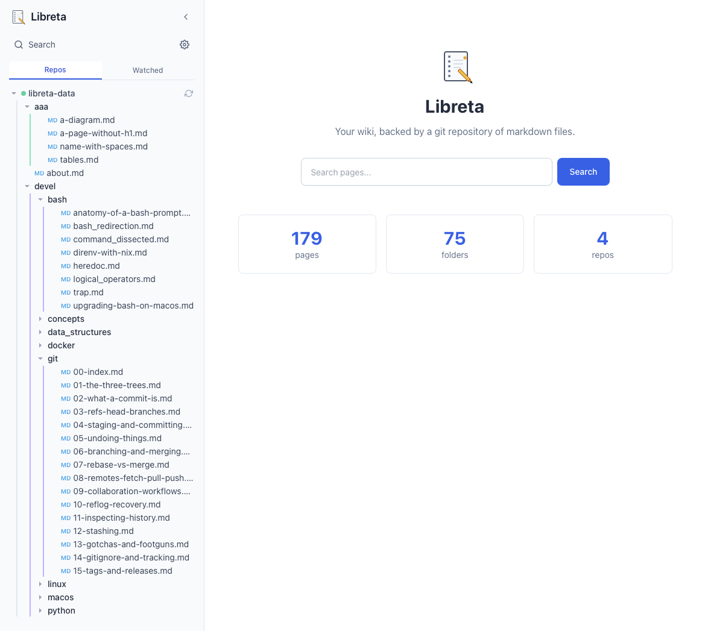

# Libreta

> A self-hosted wiki where the source of truth is a directory of plain markdown files in a git repository — with a Confluence-grade WYSIWYG editor and first-class diagrams.net integration on top.

**Status**: v1.0 release candidate. Editing, search, diagrams, git-source sync, and the production deployment story are all in. See [`docs/PROGRESS.md`](./docs/PROGRESS.md) for what landed and [`docs/ROADMAP.md`](./docs/ROADMAP.md) for what's beyond v1.



## Why this exists

Self-hosted wiki tools today force a tradeoff:

| Tool | Markdown files on disk | Git versioned | Native diagrams.net | Confluence-style WYSIWYG |
|---|---|---|---|---|
| Wiki.js | ⚠️ DB is source of truth, git is sync | ⚠️ via sync module | ❌ DIY sidecar | ✅ |
| BookStack | ❌ HTML in MariaDB | ❌ | ✅ | ✅ |
| Docmost | ❌ DB | ❌ | ✅ | ✅ |
| Wikmd | ✅ | ✅ | ❌ | ❌ |
| **Libreta** | ✅ | ✅ | ✅ | ✅ |

Libreta aims to combine the portability and grep-ability of file-based wikis with the editing experience of database-backed ones.

See [`docs/PROJECT.md`](./docs/PROJECT.md) for full motivation, principles, and non-goals.

## Quickstart

You need: Docker Engine 24+, the `docker compose` plugin, and a git repository
to use as your wiki (it can be empty — Libreta will populate it).

```bash
# 1. Clone Libreta
git clone https://github.com/<you>/libreta.git
cd libreta

# 2. Build and start the production stack
make build-prod
VERSION=$(cat VERSION) docker compose \
    -f docker-compose.yml -f docker-compose.prod.yml up -d

# 3. Open http://localhost:8080 in a browser, then go to /-/admin
#    to add your wiki's git source. Libreta clones it for you.
```

That's it. Pages are stored as markdown files inside the git repository you
configured — every save is a commit, and Libreta pushes back to your remote
asynchronously. You can `git clone` the same repo elsewhere, edit in any
editor, push, and Libreta picks up the changes on its next sync.

> Want HTTPS? Use the Caddy overlay — see [`docs/DEPLOY.md`](./docs/DEPLOY.md).
>
> Want to develop on Libreta itself? See [Dev vs prod](#dev-vs-prod) below.

### Dev vs prod

The Compose layout has two modes. Pick based on what you're doing:

| | Dev (`make dev` / `make up-dev` / `make rebuild-dev`) | Prod (`make up` / `make rebuild`) |
|---|---|---|
| Compose files | `docker-compose.yml` + `docker-compose.dev.yml` | `docker-compose.yml` only |
| Backend source | bind-mounted from `./backend/src`; uvicorn `--reload` picks up edits live | baked into the image at build time; no reloader |
| Frontend | Vite dev server with HMR (port 8091) | not served by Compose — build `frontend/dist` and put it behind your reverse proxy of choice (Caddy/Nginx) |
| When to rebuild | only when dependencies change (`pyproject.toml`, `pnpm-lock.yaml`, `Dockerfile`) | every code change before deploy |

The Makefile wraps both modes; you rarely need to type the raw `docker compose` command. Run `make help` for the full menu.

### Useful targets

```bash
make help                  # Show all available targets
make check                 # Run all pre-flight checks (lint + types + tests)
make import-dokuwiki-dry   # Preview a DokuWiki import without writing
make import-dokuwiki       # Import a DokuWiki installation into your wiki
                           #   override: SOURCE=/path/to/dokuwiki/storage/data make import-dokuwiki
```

## Features (target for v1)

- 📝 **Pages stored as markdown files** with YAML frontmatter — your content is portable, greppable, and survives Libreta.
- 🔀 **Git as the source of truth** — every save is a commit. Optional remote push to GitHub / Gitea / Forgejo.
- ✨ **WYSIWYG editor** with markdown round-trip via Tiptap.
- 🎨 **diagrams.net integrated** — toolbar button opens the editor inline, diagrams saved as `.drawio.svg`.
- 🖼️ **Image and arbitrary file uploads** — stored in `_attachments/` next to pages.
- 📊 **Confluence-style tables** — resizable columns, header rows, cell colours.
- 🔍 **Full-text search** — SQLite FTS5 index, regenerable from the file tree at any time.
- 📱 **Responsive** — works on mobile and desktop.
- 🐳 **One-command deploy** via Docker Compose.

See [`docs/ROADMAP.md`](./docs/ROADMAP.md) for what's planned beyond v1 (auth, multi-user, plugins, etc.).

## Documentation

User-facing — start here if you want to **use** Libreta:

| Page | What's there |
|---|---|
| [`docs/site/index.md`](./docs/site/index.md) | Landing page — what Libreta is and isn't |
| [`docs/site/getting-started.md`](./docs/site/getting-started.md) | Five-minute install & first page |
| [`docs/site/faq.md`](./docs/site/faq.md) | Frequently asked questions |
| [`docs/site/troubleshooting.md`](./docs/site/troubleshooting.md) | Symptoms → causes → fixes |

These pages are written as a Libreta-flavoured markdown corpus on
purpose: point a Libreta instance at the [`docs/site/`](./docs/site/)
directory and it dogfoods as a small site about itself.

Reference and project docs:

| File | Purpose |
|---|---|
| [`docs/PROJECT.md`](./docs/PROJECT.md) | Motivation, principles, non-goals, success criteria |
| [`docs/ARCHITECTURE.md`](./docs/ARCHITECTURE.md) | Components, data model, tech stack, deployment topology |
| [`docs/ROADMAP.md`](./docs/ROADMAP.md) | Milestones M0 → M5 |
| [`docs/PROGRESS.md`](./docs/PROGRESS.md) | Current state of execution |
| [`docs/DEPLOY.md`](./docs/DEPLOY.md) | Production deployment (Docker Compose + Caddy + TLS) |
| [`docs/BACKUP.md`](./docs/BACKUP.md) | Backup & restore — what to snapshot, how to recover |
| [`docs/MIGRATION-APPLE-NOTES.md`](./docs/MIGRATION-APPLE-NOTES.md) | Migrating from Apple Notes (importer + caveats) |
| [`docs/SECURITY-REVIEW.md`](./docs/SECURITY-REVIEW.md) | Pre-1.0 security review — threat model, findings, known limitations |
| [`docs/PERFORMANCE.md`](./docs/PERFORMANCE.md) | Smoke benchmarks vs the NFRs in PROJECT.md |
| [`CLAUDE.md`](./CLAUDE.md) | Conventions and guardrails for Claude Code agents working on this repo |

## License

Libreta is licensed under the **GNU Affero General Public License v3.0**
([`LICENSE`](./LICENSE)). The AGPL choice is deliberate: if you run a
modified Libreta as a network service, the AGPL requires you to make
your modifications available to the users of that service. This matches
the wiki ecosystem norm (Wiki.js, BookStack) and ensures the project's
git-as-source-of-truth ethos extends to its own code.

> SPDX-License-Identifier: AGPL-3.0-only
