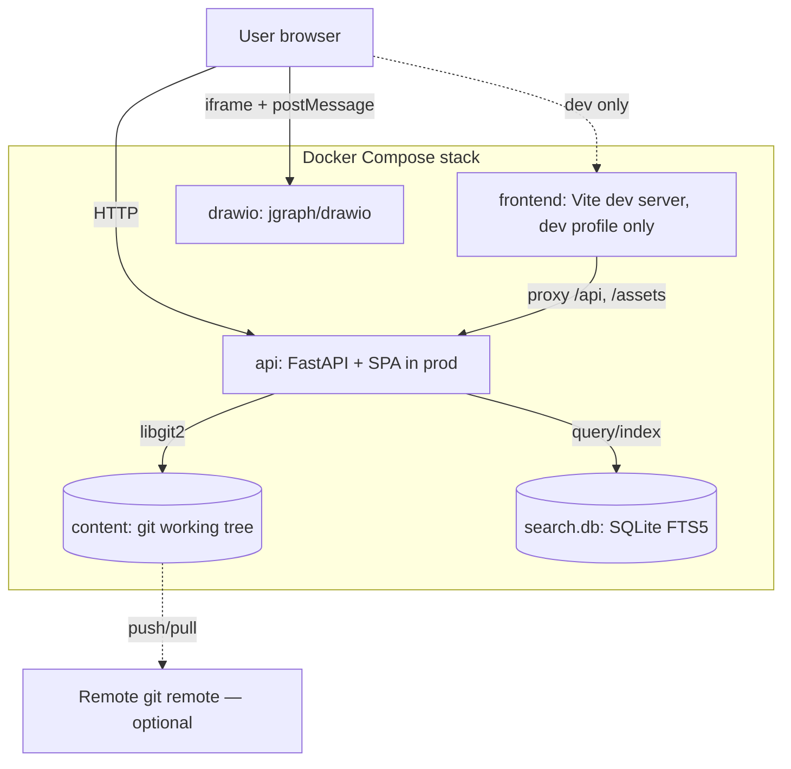

# Libreta — Architecture

## Contents

1. [Overview](#overview)
2. [System diagram](#system-diagram)
3. [Components](#components)
4. [Technology choices](#technology-choices)
5. [Data model](#data-model)
6. [Storage layer](#storage-layer)
7. [HTTP API](#http-api)
8. [Frontend](#frontend)
9. [Editor and markdown roundtrip](#editor-and-markdown-roundtrip)
10. [Diagrams.net integration](#diagramsnet-integration)
11. [Asset handling](#asset-handling)
12. [Search](#search)
13. [Authentication (forward-looking)](#authentication-forward-looking)
14. [Deployment topology](#deployment-topology)
15. [Key decisions](#key-decisions)
16. [Open questions](#open-questions)

## Overview

Libreta is a thin Python/FastAPI application that turns a git-managed directory of markdown files into a navigable, editable wiki. The filesystem is the source of truth. Auxiliary state (search index, cache) is rebuildable from the filesystem alone.

Three containers in development; two in production.

**Development** (`docker compose --profile dev up`):

- **api** — FastAPI app, serves REST API and asset files. In dev, does *not* serve the frontend bundle.
- **frontend** — Vite dev server with HMR, proxies `/api` and `/assets` to the api container.
- **drawio** — `jgraph/drawio` Docker image, embedded via iframe by the editor.

**Production** (default profile):

- **api** — FastAPI app, serves the *built* Vue SPA from `/`, plus REST API and asset files. The frontend container is not used.
- **drawio** — same as in dev.

In both modes, the **content** working tree (a git repo on a bind-mounted host directory) is mutated by the api process via libgit2.

## System diagram



## Components

### `api` — backend

A FastAPI application that:

- Serves the compiled Vue SPA from `/` (production only)
- Exposes a versioned REST API at `/api/v1/...`
- Serves uploaded assets at `/assets/...`
- Mediates all writes to the content repo (no other process writes to it)
- Maintains a SQLite-based search index in the background

### `frontend` — Vite dev server (development only)

A Node container running `pnpm dev`. Provides hot module reload during development. Proxies `/api/v1/*` and `/assets/*` to the `api` container. **Not used in production** — production builds the SPA into a static bundle that the api container serves.

### `drawio` — diagram editor

The official `jgraph/drawio` image, run as a sidecar container. Loaded in a sandboxed iframe from the SPA. Communicates via the documented `postMessage` protocol. No state persists in this container — diagrams are saved by the api process to the content repo.

### `content` — repository volume

A bind-mounted directory containing:

- `.git/` — the version control history
- `pages/` — markdown files
- `assets/` — uploaded files (images, attachments, diagrams)

This is the only stateful volume that matters. Backups = back this up.

## Technology choices

| Layer                | Choice                                  | Why                                                                                                        |
| -------------------- | --------------------------------------- | ---------------------------------------------------------------------------------------------------------- |
| Language             | Python 3.12+                            | User preference; rich ecosystem for markdown, git, search.                                                 |
| Web framework        | FastAPI                                 | Async, OpenAPI out of the box, good DX.                                                                    |
| ASGI server          | Uvicorn (with uvloop)                   | Standard pairing for FastAPI.                                                                              |
| Git library          | pygit2 (libgit2 bindings)               | In-process, fast, no shell-out. Avoids the subprocess fragility seen in Wiki.js.                           |
| Markdown parser      | markdown-it-py                          | CommonMark compliant, extensible, mirrors the JS markdown-it the editor uses (consistent rendering both sides). |
| Frontmatter          | python-frontmatter                      | YAML metadata in `.md` files.                                                                              |
| Validation           | Pydantic v2                             | First-class FastAPI integration.                                                                           |
| Search               | SQLite FTS5                             | Zero infra, embedded, sufficient for personal-scale corpora. Upgrade path: tantivy or Meilisearch sidecar. |
| Image processing     | Pillow                                  | Thumbnails, format conversion.                                                                             |
| Filesystem watcher   | watchdog                                | Detects external edits (e.g. user `vim`'d a file) and triggers reindex.                                    |
| Frontend framework   | Vue 3 + TypeScript                      | Familiar territory (Wiki.js too), excellent TipTap bindings.                                               |
| Build tool           | Vite                                    | Fast dev loop, simple config.                                                                              |
| State management     | Pinia                                   | Vue 3 standard.                                                                                            |
| Editor               | TipTap (ProseMirror)                    | Modern, extensible, good Vue integration. Used in production wikis like Docmost.                           |
| Markdown ↔ HTML      | tiptap-markdown + custom serializers    | See [editor section](#editor-and-markdown-roundtrip).                                                      |
| Source-mode editor   | CodeMirror 6                            | Lightweight, modern, good markdown support.                                                                |
| Styling              | Tailwind CSS                            | Solo-dev productive, mobile-first.                                                                         |
| Syntax highlighting  | Shiki (build-time) / highlight.js (run) | TBD per perf testing.                                                                                      |
| Container runtime    | Docker / Docker Compose v2              | Universal.                                                                                                 |

### Decisions deliberately deferred

- **Reverse proxy** (Caddy/Traefik) — not bundled in v1; users add their own. Keeps the compose file small.
- **Job queue** (Celery/RQ/arq) — not needed at v1 scale. Use FastAPI `BackgroundTasks` for git commits and indexing.
- **Migrations framework** — no DB schema beyond search index, which is rebuildable from filesystem.

## Data model

### Filesystem layout

```
content/                          # git repo root
├── .git/
└── pages/
    ├── index.md                  # the home page
    ├── projects/
    │   ├── index.md              # /projects (chapter intro)
    │   ├── libreta.md            # /projects/libreta
    │   └── libreta/
    │       ├── notes.md          # /projects/libreta/notes
    │       ├── architecture.png  # attachment local to notes.md / libreta.md
    │       └── budget.xlsx
    └── recipes/
        ├── pizza-dough.md
        └── pizza-dough.jpg       # photo for pizza-dough.md
```

A few rules:

- A page at URL path `/foo/bar` lives at `pages/foo/bar.md`.
- A page at URL path `/foo` lives at `pages/foo.md` _or_ `pages/foo/index.md` (the index file wins if both exist).
- **Attachments live next to the page that uses them.** A page at `pages/recipes/pizza-dough.md` with `` reads from `pages/recipes/pizza-dough.jpg`. Index pages own their whole directory: a page at `pages/projects/libreta/index.md` resolves `` to `pages/projects/libreta/architecture.png`.
- Asset paths in markdown are **relative** to the page (``, `[budget](budget.xlsx)`). Root-anchored URLs (`/assets/...`) are not used.
- The `pages/` tree carries the entire wiki — both pages and their attachments. There is no separate `assets/` tree.

**Why page-local instead of a global dated `assets/` pool**: attachments stay with the content they belong to. Cloning a single subdirectory still has working images. Renaming or moving a page moves its attachments with it. Markdown references stay short. The trade-off is that an attachment used by two pages is duplicated; we accept that at solo-user scale.

**Diagrams** (per the diagrams.net integration below) follow the same rule: a `.drawio.svg` lives next to the page that embeds it.

### Page format

````markdown
---
title: "Libreta Architecture"
created: 2026-05-01T10:23:00Z
updated: 2026-05-01T14:55:00Z
tags: [libreta, architecture, docs]
---

# Libreta Architecture

The body of the page in standard CommonMark / GFM markdown.


```python
def hello() -> str:
    return "world"
```
````

Frontmatter schema (Pydantic):

```python
class PageMeta(BaseModel):
    title: str
    created: datetime
    updated: datetime
    tags: list[str] = []
    # extension point for future fields
```

Unknown frontmatter keys are preserved on roundtrip — Libreta reads what it knows and leaves the rest alone.

## Storage layer

### Write path

Every page save:

1. Validate the incoming markdown (parses cleanly, frontmatter valid).
2. Acquire a per-repo write lock (asyncio lock; only one git operation at a time).
3. Write the file to the working tree.
4. Stage and commit using pygit2 with a structured message (see below).
5. Notify the indexer (in-process queue) to reindex the changed file.
6. Optionally push to a configured remote (async, fire-and-forget with retry).
7. Release the lock and return.

### Commit message format

```
<verb> <path>

Optional body with a brief change summary.

Co-authored-by: <user> <email>   # for future multi-user
```

Verbs: `create`, `update`, `delete`, `rename`, `attach`, `draw`. Examples:

```
update pages/projects/libreta.md
create pages/recipes/pizza-dough.md
attach pages/recipes/pizza-dough.jpg
draw   pages/projects/libreta/auth-flow.drawio.svg
```

This makes `git log --oneline` immediately scannable.

### Read path

- Lists and trees: `os.scandir` from the working tree (cheap; the kernel caches it).
- Page content: read the file. No object-DB lookup.
- History: pygit2 walk of commits touching the path.
- Specific revision: pygit2 blob lookup at the given OID.

### External edits

A user may edit files directly with VS Code or `git pull` from a remote. The api process watches `content/` with `watchdog`; on detected change it re-indexes affected files. The frontend's page-tree query is short-TTL cached so external edits show up within seconds.

## HTTP API

All routes prefixed with `/api/v1`. JSON throughout. OpenAPI at `/api/v1/docs`.

### Pages

| Method | Path                                       | Description                                           |
| ------ | ------------------------------------------ | ----------------------------------------------------- |
| GET    | `/pages/tree`                              | Hierarchical page tree                                |
| GET    | `/pages/{path:path}`                       | Read page (markdown source + rendered HTML + meta)    |
| PUT    | `/pages/{path:path}`                       | Create or update page                                 |
| DELETE | `/pages/{path:path}`                       | Delete page                                           |
| POST   | `/pages/{path:path}/move`                  | Move/rename page (body: `{ "to": "new/path" }`)       |
| GET    | `/pages/{path:path}/history`               | List of commits touching this page                    |
| GET    | `/pages/{path:path}/revisions/{sha}`       | Page content at a specific commit                     |
| GET    | `/pages/{path:path}/diff/{sha_a}/{sha_b}`  | Diff between two revisions                            |

### Assets

| Method | Path                              | Description                                                                                                                                                                                          |
| ------ | --------------------------------- | ---------------------------------------------------------------------------------------------------------------------------------------------------------------------------------------------------- |
| POST   | `/pages/{path:path}/assets`       | Upload an attachment (multipart `file`). Writes to the owning page's directory and commits. Returns `{ filename, size, sha256, kind }` — `filename` is the relative ref to embed in markdown. |
| GET    | `/assets/{path:path}`             | Serve asset file (path is into the content tree, e.g. `pages/recipes/pizza-dough.jpg`).                                                                                                              |
| DELETE | `/assets/{path:path}`             | Remove asset (deferred; not in M3 scope).                                                                                                                                                            |

### Diagrams

| Method | Path                              | Description                                                                                                                                            |
| ------ | --------------------------------- | ------------------------------------------------------------------------------------------------------------------------------------------------------ |
| POST   | `/pages/{path:path}/diagrams`     | Save a new diagram (multipart `.drawio.svg`) into the owning page's directory. Returns `{ filename, size }`.                                          |
| PUT    | `/pages/{path:path}/diagrams/{filename}` | Update an existing diagram in the page's directory.                                                                                          |
| GET    | `/assets/{path:path}`             | Fetch diagram (same route as ordinary assets — `.drawio.svg` is just an SVG file).                                                                    |

### Search

| Method | Path                       | Description                                  |
| ------ | -------------------------- | -------------------------------------------- |
| GET    | `/search?q=...&limit=20`   | Full-text search; ranked hits with snippets  |

### System

| Method | Path        | Description                                      |
| ------ | ----------- | ------------------------------------------------ |
| GET    | `/healthz`  | Liveness                                         |
| GET    | `/readyz`   | Readiness (repo accessible, index loaded)        |
| GET    | `/info`     | Version, build, content repo metadata            |

## Frontend

### Routes (Vue Router)

| Route              | View          | Notes                       |
| ------------------ | ------------- | --------------------------- |
| `/`                | PageView      | Home — `pages/index.md`     |
| `/w/:path*`        | PageView      | Read-only view              |
| `/edit/:path*`     | EditorView    | WYSIWYG editor              |
| `/history/:path*`  | HistoryView   | Commit list, diff viewer    |
| `/search`          | SearchView    |                             |
| `/-/admin`         | AdminView     | Stub for future settings    |

### State

Pinia stores:

- `pageStore` — current page content, dirty flag, save status
- `treeStore` — page hierarchy (cached)
- `assetStore` — recent uploads
- `uiStore` — theme, sidebar collapsed, breakpoint

### Component tree (high level)

```
App.vue
├── AppShell.vue                   # sidebar + topbar layout
│   ├── Sidebar.vue (PageTree.vue)
│   ├── TopBar.vue (Search, theme, user menu placeholder)
│   └── <RouterView>
│       ├── PageView.vue           # rendered page
│       ├── EditorView.vue
│       │   └── Editor.vue         # TipTap instance
│       │       ├── EditorToolbar.vue
│       │       ├── DiagramNode.vue
│       │       └── TableNode.vue
│       └── HistoryView.vue
```

## Editor and markdown roundtrip

This is the trickiest part of the system. We must:

1. Load `.md` from disk → render in TipTap (HTML / ProseMirror).
2. On save, produce `.md` bytes that are stable: re-saving an unchanged document must produce identical bytes.

### Approach

- **Parser:** a single canonical markdown-it instance, configured identically in Python (markdown-it-py) and TS (markdown-it). Same plugins, same options. This guarantees the api's server-rendered HTML matches the editor's view.
- **Serializer:** the editor exports TipTap state to markdown using `tiptap-markdown` for common nodes, with custom serializers for non-trivial nodes (tables, diagram embed, callout).
- **Stability tests:** the test suite includes a corpus of representative `.md` files. Each is parsed → serialized and compared byte-for-byte. Any drift is a bug.

### Supported markdown features

- CommonMark core
- GFM tables, task lists, strikethrough, autolinks
- Fenced code blocks with language hints
- Inline HTML (preserved verbatim, not edited via WYSIWYG)
- YAML frontmatter (treated as metadata, not body)
- Wiki-style links: `[[Page Title]]` (custom plugin)
- Drawio embed: `` — detected by extension
- Mermaid: ` ```mermaid ` fenced blocks (rendered as image in view mode; source-only editing in v1)
- Callouts: `> [!NOTE]` / `> [!WARNING]` style (GitHub-compatible)

### Source mode

The editor toggles between WYSIWYG and a CodeMirror 6 markdown source view. The source view is the canonical view; WYSIWYG is a projection of it. Toggling source → wysiwyg → source must be idempotent.

## Diagrams.net integration

### Storage format

Diagrams are saved as `.drawio.svg` — SVG with the original drawio XML embedded in a `<mxGraphModel>` element. This format:

- Renders as a regular image when displayed inline (no JS required).
- Is editable in any drawio install (web, desktop, VS Code extension).
- Is a single file, gits cleanly, diffs readably.

Diagrams are addressed in markdown as ordinary images:

```markdown

```

The editor recognizes the `.drawio.svg` suffix and switches the rendered image into an "edit" affordance.

### Edit flow

1. User clicks an existing diagram or "Insert Diagram" in the toolbar.
2. The editor opens a modal containing an iframe pointing to `http://drawio:8080/?embed=1&proto=json&spin=1&saveAndExit=1`.
3. The drawio iframe sends `init` via postMessage; we reply with `load` carrying the existing XML (or empty string for new diagrams).
4. User edits, clicks Save.
5. Drawio replies with `save` — payload is the SVG with embedded XML.
6. We POST the SVG to `/api/v1/pages/{owning-page}/diagrams` (or PUT to the same path with the existing filename if updating).
7. The api commits the asset into the page's directory and returns the relative filename.
8. The editor inserts/updates the image node referencing the new filename (relative ref).

The drawio container is configured for offline operation — no external resources fetched.

### Why not Mermaid only?

Mermaid is great for code-defined diagrams in CI workflows. It is not great for the kind of free-form architecture and box-and-line drawings users actually make in Confluence-like tools. Libreta supports both: Mermaid in fenced code blocks for code-as-diagram, drawio for hand-authored diagrams.

## Asset handling

- Uploads are scoped to a page. The upload endpoint takes the owning page path; the asset is written to that page's directory (see "Filesystem layout" — for an `index.md` page, the directory is the page's own folder; for a leaf page, it is the parent folder of the `.md` file).
- Uploads pass through size and MIME validation.
- Images: Pillow generates a thumbnail (max 1200 px wide, JPEG q85) saved alongside the original. (Deferred until image-handling proves it earns its weight — original-only upload is acceptable for v1.)
- All assets are committed to git. Trade-off: repo size grows. Acceptable at personal scale; LFS is a v2+ option.
- Deduplication: content-hash (SHA-256) is checked at upload time, **scoped to the owning page's directory**. Identical bytes already present in that directory → existing filename returned without a new commit. Bytes shared across two pages are duplicated (one copy per page); we accept that.
- Filename collisions with non-identical bytes get a numeric suffix: `photo.jpg` → `photo-2.jpg`, etc.
- **Orphans are kept, not garbage-collected on save.** If a user removes an image or link from a page, the underlying file stays in the page's directory. Rationale: every save is already a commit (R3), so removed assets are still reachable via git history — but a file the user *might* want back next minute should not vanish from the working tree on a reflexive edit. A future `libreta gc` CLI may surface and optionally remove orphan files; until then the policy is "the filesystem is append-only on the asset axis, modulo git rewrites." Deciding orphan status correctly requires scanning *all* sibling `.md` files in the directory (a leaf page and its index page share a directory and may both reference the same file), which is straightforward but deferred.

## Search

### v1: SQLite FTS5

- Background indexer subscribes to filesystem change events.
- Per-page row in `documents` virtual table: `(path, title, body, tags, updated)`.
- Query syntax surfaced minimally: phrase search, prefix search, tag filter (`tag:foo`).
- Snippets via FTS5's built-in `snippet()` function.

### Schema

```sql
CREATE VIRTUAL TABLE documents USING fts5(
    path UNINDEXED,
    title,
    body,
    tags,
    updated UNINDEXED,
    tokenize = 'porter unicode61 remove_diacritics 2'
);
```

### Reindex

- On startup, walk `pages/` and rebuild incrementally (skip unchanged by mtime).
- On every commit, reindex the affected paths.
- Manual full reindex via CLI: `libreta reindex`.

## Authentication (forward-looking)

Out of scope for v1. The API is designed to accept an authenticating principal middleware later without restructuring:

- All routes already accept (currently ignored) authorization headers.
- A `Principal` Pydantic model with a single `local-admin` instance is injected via FastAPI dependency.
- Future: replace dependency with a real auth resolver (session cookie, OIDC).

When multi-user lands:

- Local accounts via Argon2id password hashing, stored in SQLite.
- OIDC via Authlib (Authentik, Keycloak, Google).
- Per-tree ACLs stored in `.libreta-permissions.yaml` files inside `pages/` (versioned with the content).

## Deployment topology

### docker-compose.yml shape (illustrative)

```yaml
services:
  api:
    build: ./backend                  # dev: build from source
    image: libreta:${LIBRETA_VERSION:-latest}
    restart: unless-stopped
    environment:
      LIBRETA_CONTENT_DIR: /content
      LIBRETA_DRAWIO_URL: http://drawio:8080
      LIBRETA_REMOTE_URL: ${LIBRETA_REMOTE_URL:-}
    volumes:
      - ./data/content:/content
      - libreta-search:/var/lib/libreta
    ports:
      - "8092:8080"                   # api: host 8092 → container 8080
    depends_on:
      - drawio

  frontend:
    profiles: ["dev"]                 # dev only — production serves SPA from api
    build: ./frontend
    environment:
      VITE_API_BASE: http://api:8080
    volumes:
      - ./frontend:/app
      - /app/node_modules
    ports:
      - "8091:5173"                   # frontend: host 8091 → container 5173
    depends_on:
      - api

  drawio:
    image: jgraph/drawio:latest
    restart: unless-stopped
    ports:
      - "8093:8080"                   # drawio: host 8093 → container 8080 (for the editor iframe)

volumes:
  libreta-search:
```

### Production hardening (user responsibility)

- Place behind a reverse proxy (Caddy, Traefik, nginx) for TLS.
- Configure remote git push via SSH key mounted into the api container.
- Schedule offsite backups of `./content`.

## Key decisions

The following are decisions worth pinning down explicitly. Each is revisitable but should not be revisited casually.

### D-01 — Filesystem is the source of truth

Not the database. Not git objects. The working tree.

**Why:** it is what the user can read with any tool, on any system, with no Libreta dependency. It is the data-portability promise.

**Consequence:** every API write goes through the same filesystem-then-commit code path. There is no path that updates state without producing a `.md` file.

### D-02 — pygit2, not subprocess git

**Why:** pygit2 wraps libgit2 in-process. No subprocess overhead, no shell-quoting bugs, atomic operations, no race with concurrent git commands.

**Consequence:** adds a non-trivial native dependency. We accept this cost; it is paid by `pip install` and the docker image build.

### D-03 — TipTap, not Toast UI / Milkdown / a custom editor

**Why:** largest extension ecosystem of the modern markdown WYSIWYG editors. Solid Vue integration. Battle-tested in production wikis (Docmost, others).

**Consequence:** markdown roundtrip is our responsibility (TipTap is HTML-native). Mitigated by stability tests.

### D-04 — Vue 3, not React or Svelte

**Why:** familiar, mature, less ceremony than React for solo development; richer editor ecosystem than Svelte.

**Consequence:** smaller hiring pool than React if this ever becomes a team project; acceptable.

### D-05 — drawio as a sidecar, not bundled

**Why:** upstream image is well-maintained; we get updates for free. Bundling drawio's JS into our app would be a maintenance tax.

**Consequence:** two containers in the compose file instead of one. Worth it.

### D-06 — Single-instance, single-writer model

**Why:** avoids merge conflicts entirely. A shared editor across multiple servers is a v3+ problem, not a v1 problem.

**Consequence:** external edits via `git pull` are supported (we re-read), but two Libreta instances pointed at the same remote will fight. Don't do that.

### D-07 — Git as version control, not as content store

We do not read content from git objects on the hot path. We read from the working tree. Git is for history and remote sync.

**Why:** performance (file reads vs. object lookups), simplicity, and the working tree's role as the user-facing artifact.

### D-08 — No realtime collaboration in v1

**Why:** Y.js / Hocuspocus-grade collaboration is a project of its own. v1 is a personal wiki; collaboration is v3.

## Open questions

- **Wiki-link resolution:** `[[Pizza Dough]]` — fuzzy match on title, or strict path? (Leaning: title fuzzy with a disambiguation UI when ambiguous.)
- **Rename strategy:** `git mv` plus a link-fixup pass across the corpus, or break links and notify? (Leaning: rewrite links in a single commit, surfaced in the diff.)
- **Soft delete vs. hard delete:** the file leaves the working tree; git history retains it regardless. (Leaning: hard delete from working tree.)
- **Asset garbage collection:** orphaned uploads — periodic sweep or never? (Leaning: weekly sweep with a quarantine period.)
- **Default branch and remote semantics:** opinionated to `main` and a single configured remote.
- **CRDT layer for offline edits:** out of scope until v3, but the data model should not preclude it.
