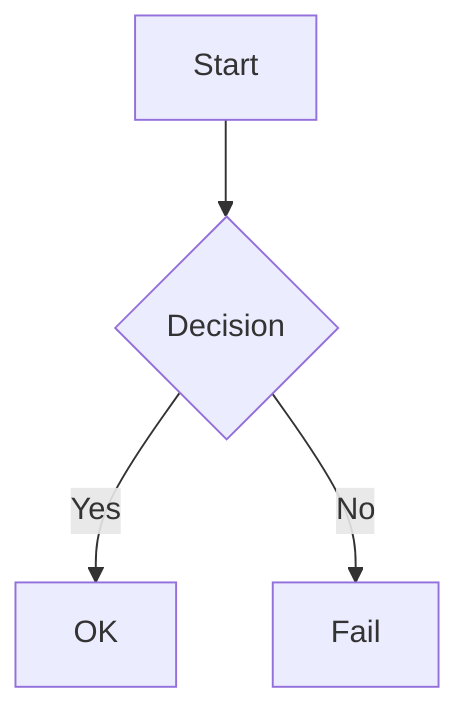
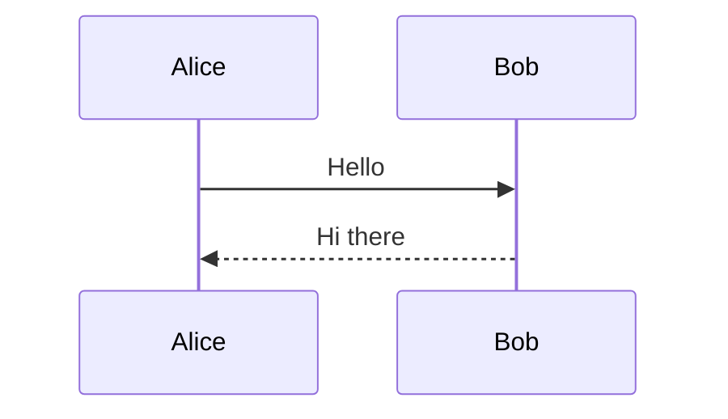

A flowchart:

```mermaid
graph TD
    A[Start] --> B{Decision}
    B -->|Yes| C[OK]
    B -->|No| D[Fail]
```

And a sequence diagram:

```mermaid
sequenceDiagram
    Alice->>Bob: Hello
    Bob-->>Alice: Hi there
```